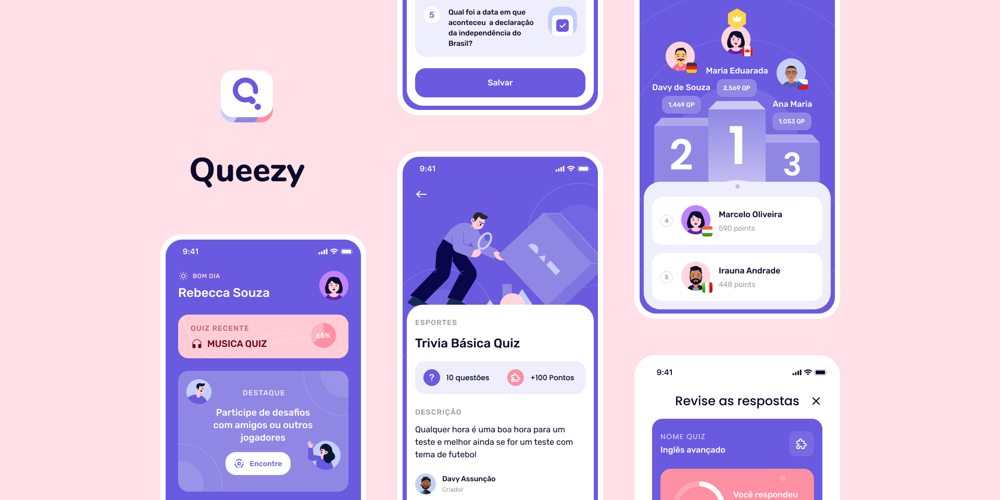

# Quezzy Backend

<h1 align="center">
  
</h1>

## 🔎 Sobre

Aplicação educacional que utiliza gamificação para transformar o aprendizado em uma experiência interativa, promovendo engajamento com questões lúdicas e conteúdos sobre cidadania e sustentabilidade.

## 🚀 Começando

Para rodar o projeto no <b>ambiente local</b> siga os passos a seguir:

```bash
git clone git@github.com:DavySz/quezzy-backend.git
```

Abra o projeto na sua IDE de preferência e crie na raiz do projeto o arquivo <b>.env</b>:

```bash
SPRING_PROFILES_ACTIVE=dev
DATABASE_URL=jdbc:postgresql://java_db:5432/postgres
DATABASE_USERNAME=postgres
DATABASE_PASSWORD=postgres
```

Em seguida, no terminal rode o comando:

```bash
docker-compose up --build
```
</br>

## 🧪 Teste a API

Após rodar o projeto localmente, você pode acessar a documentação do projeto no <b>swagger</b>, abrindo esta URL no seu navegador:

```bash
http://localhost:8080/swagger-ui/index.html
```

Caso você queira usar o insomnia para testar os endpoints locamente, segue o JSON para importar:

[Download Insomnia Collection](https://drive.google.com/file/d/175i8yG9J5tMiCaRo2PyIvaWUXR5AAK32/view?usp=sharing)

</br>

## 🛠️ Funcionalidades

- [x] Criação de suários
- [x] Atualização de usuários
- [x] Deletar usuários existentes
- [x] Atualizar usuários existentes
      
</br>

- [x] Criação de categorias
- [x] Atualização de categorias
- [x] Deletar categorias existentes
- [x] Atualizar categorias existentes

</br>

- [X] Criação de questões
- [x] Atualização de questões
- [x] Deletar questões existentes
- [x] Atualizar questões existentes
- [X] Listar questões por categoria
</br>

## ✨ Tecnologias

- [x] Java
- [x] Spring Boot
- [x] Hibernate
- [x] Postgresql
</br>

---
<p align="center">Feito com ❤️ por Davy Assunção</p>
